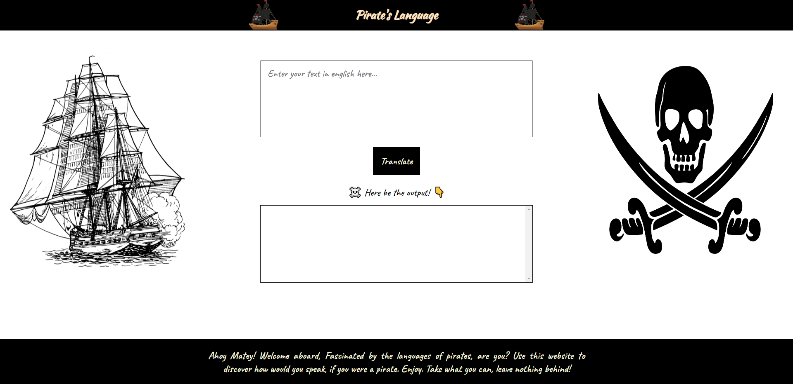
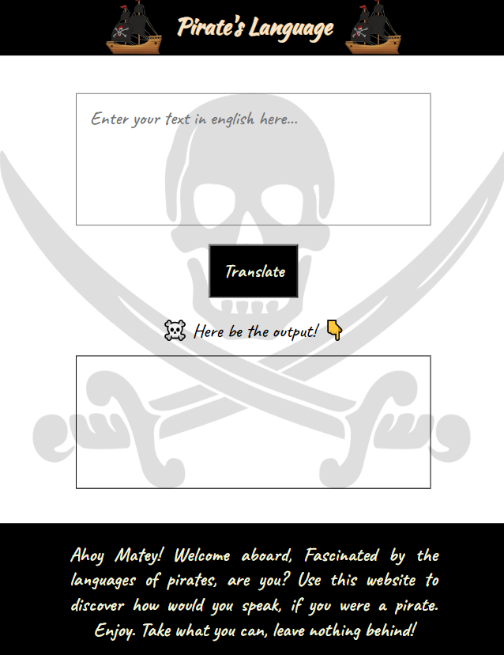

# Pirate Language Convertor

Convert your regular language into a pirate's language. Savy?

* Web app is made from HTML, CSS and Vanilla JS.
* Responsive by design.
* API limit is upto 5 per hour.
* Uses API from [API fun translation](https://funtranslations.com/)

You can find API for this website [here.](https://funtranslations.com/pirate)

Visit website [here](https://the-pirate-speak.netlify.app/)

